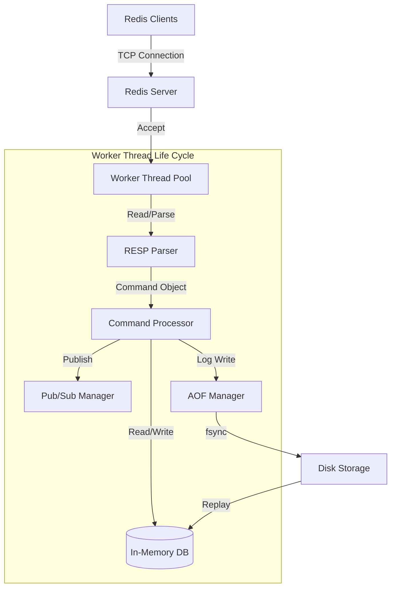

# Redis-In-Java

[](https://jdk.java.net/21/)
[](https://maven.apache.org/)
[](LICENSE)
[](https://redis.io/docs/reference/protocol-spec/)

> A high-performance, multithreaded Redis server implementation built from scratch in Java. Designed to demonstrate advanced concurrency patterns, strict protocol compliance, and system-level architecture.

---

## 📖 Overview

**Redis-In-Java** is a robust, clean-room implementation of the Redis server. It is not just a toy project; it mimics the core architecture of Redis to provide a reliable, in-memory key-value store. It supports the standard **RESP (Redis Serialization Protocol)**, making it compatible with any standard Redis client (like `redis-cli`, `jedis`, or `lettuce`).

This project showcases:
*   **System Design**: Clean separation of concerns (Networking, Protocol parsing, Command execution, Storage).
*   **Concurrency**: Efficient handling of concurrent clients using thread pools and thread-safe data structures.
*   **Persistence**: Durability guarantees via AOF (Append Only File) logs.
*   **Real-time Messaging**: Full Pub/Sub implementation.

---

## 🏗 Architecture

The server follows a classic threaded-I/O architecture optimized for clarity and throughput.



### Key Components

*   **Networking Layer**: Uses `ServerSocket` with a cached thread pool to handle thousands of concurrent connections (blocking I/O model).
*   **Protocol Handler**: Custom, zero-dependency RESP parser/writer that handles pipelining and complex data types (Arrays, Bulk Strings, integers, Errors).
*   **Storage Engine**: Thread-safe in-memory database utilizing `ConcurrentHashMap` with atomic operations for consistency.
*   **AOF Persistence Engine**:
    *   Logs write operations to an append-only file.
    *   Supports robust crash recovery (Replay on startup).
    *   Configurable `fsync` policies (`ALWAYS`, `EVERYSEC`, `NO`).

---

## 🚀 Features

### Core Capabilities
*   **⚡ High Performance**: Low-latency command execution.
*   **🔌 RESP Compatible**: Drop-in replacement for standard Redis servers for supported commands.
*   **⚙️ Configurable**: Fully configurable via `.env` file or environment variables.

### Persistent Storage (AOF)
Data is durable! The server supports Append-Only File persistence.
*   **Replay Mechanism**: Automatically restores state from disk on server startup.
*   **Safety**: Configurable fsync strategies to balance performance and data safety.

### Pub/Sub System
Real-time messaging backend.
*   `SUBSCRIBE` / `UNSUBSCRIBE`: Listen to channels.
*   `PUBLISH`: Broadcast messages to active subscribers.

### Supported Commands
| Category | Commands |
|----------|----------|
| **String** | `SET` (EX, NX, XX), `GET`, `MSET`, `MGET`, `INCR`, `DECR`, `APPEND`, `STRLEN` |
| **Hash** | `HSET`, `HGET`, `HGETALL`, `HDEL`, `HLEN`, `HEXISTS` |
| **Keys** | `DEL`, `EXISTS`, `KEYS`, `EXPIRE`, `TTL`, `TYPE`, `FLUSHALL` |
| **Pub/Sub** | `PUBLISH`, `SUBSCRIBE`, `UNSUBSCRIBE` |
| **Server** | `PING`, `ECHO`, `COMMAND` |

---

## 🛠 Getting Started

### Prerequisites
*   Java JDK 21+
*   Maven 3.6+

### Installation

1.  **Clone the repository**
    ```bash
    git clone https://github.com/BunsGlazin/redis-in-java.git
    cd redis-in-java
    ```

2.  **Build**
    ```bash
    mvn clean package
    ```

3.  **Run**
    ```bash
    java -jar target/redis-1.0-SNAPSHOT.jar
    ```

### Configuration (.env)
Create a `.env` file in the root directory to customize your server:

```properties
# Server Port
REDIS_PORT=6379

# Threading (0 = cached/unlimited)
REDIS_MAX_THREADS=0

# Persistence Configuration
REDIS_AOF_ENABLED=true
REDIS_AOF_PATH=Persistence/appendonly.aof
# Policies: ALWAYS (safest), EVERYSEC (balanced), NO (fastest)
REDIS_AOF_FSYNC=EVERYSEC
```

---

## 🧪 Testing

The project includes a comprehensive suite of unit and integration tests.

```bash
mvn test
```

Start a client and test manually:
```bash
redis-cli
127.0.0.1:6379> PING
PONG
127.0.0.1:6379> SET user:1 "Alice"
OK
127.0.0.1:6379> GET user:1
"Alice"
```